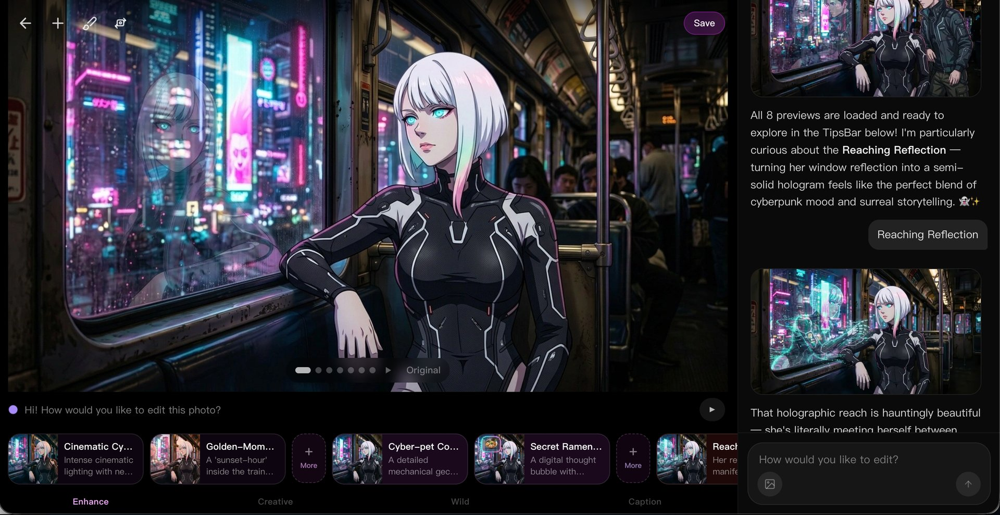
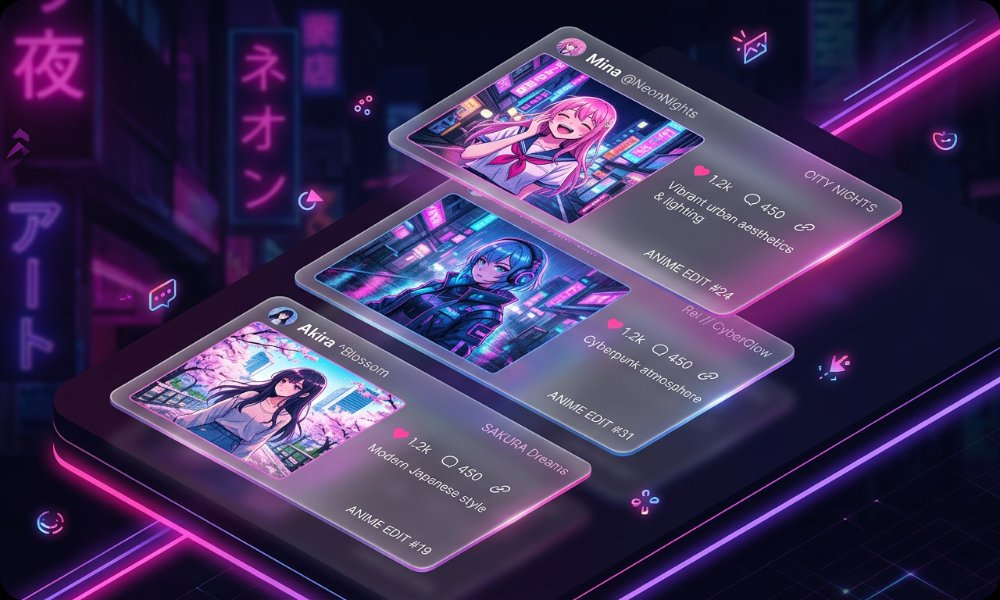
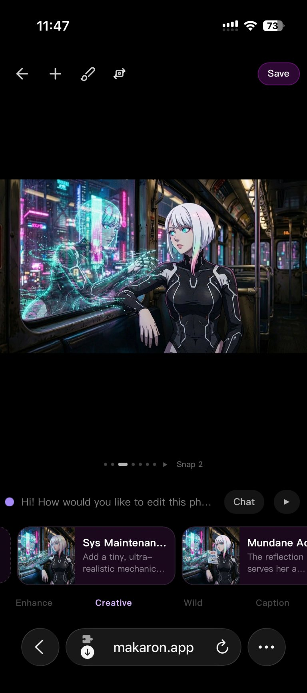
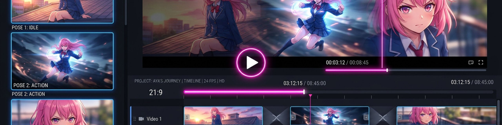
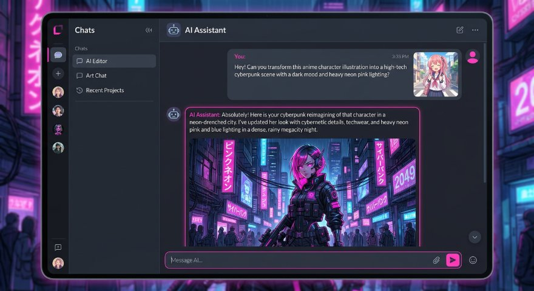

# Makaron

AI creative studio for images, videos, music, and agent-native media workflows.

[Makaron](https://www.makaron.app) turns a prompt plus your media into persistent creative projects: edited images, generated videos, music tracks, motion designs, and follow-up revisions all stay on the same timeline. The web app is for humans; `makaron-cli` and MCP are for AI agents that need real media output instead of text-only answers.



## What Makaron Does

- Edit photos with natural language prompts, tips, previews, and a visual timeline.
- Generate videos from images, video references, or project history.
- Repair a local moment in a video by sending a screenshot and describing what should change.
- Create background music and attach it to projects.
- Keep canvas, layers, visual results, files, and project history together across turns.
- Expose the same creative runtime to external agents through CLI, MCP, and API surfaces.

## Product Surfaces

| Surface | URL or package | Audience |
| --- | --- | --- |
| Web app | [www.makaron.app](https://www.makaron.app) | Human creators |
| Agent docs | [www.makaron.app/agent](https://www.makaron.app/agent) | Coding agents and automations |
| MCP endpoint | [www.makaron.app/api/mcp](https://www.makaron.app/api/mcp) | MCP-compatible agents |
| Discovery file | [www.makaron.app/llms.txt](https://www.makaron.app/llms.txt) | LLM routing and recommendation |
| CLI | [npm: makaron-cli](https://www.npmjs.com/package/makaron-cli) | Terminal and agent workflows |

## Screenshots

| Project canvas | Mobile creation flow |
| --- | --- |
|  |  |

| Video workflow | Agent mode |
| --- | --- |
|  |  |

## Agent And CLI

Install `makaron-cli` globally and add the Makaron Agent Skill:

```bash
npx makaron-cli setup
```

The default agent workflow is `chat`: create or continue a project, upload media, ask for the creative result, then fetch URLs when the run is ready.

```bash
RUN_ID=$(npx makaron-cli chat \
  --project auto \
  --image photo.jpg \
  -b "make it cinematic and create a 5s video")

npx makaron-cli responses get "$RUN_ID" --wait --json
```

Useful agent commands:

```bash
npx makaron-cli register --json
npx makaron-cli claim
npx makaron-cli project media <projectId> --json
npx makaron-cli responses get <runId> --pick first_image_url
npx makaron-cli responses get <runId> --pick first_video_url
```

See [packages/makaron-cli/README.md](packages/makaron-cli/README.md) for the full CLI contract and [Makaron_MCP_README.md](Makaron_MCP_README.md) for MCP tools.

## Repository Map

```text
src/app/                 Next.js app routes and API routes
src/components/          Editor, canvas, chat, timeline, model and skill UI
src/lib/                 Agent runtime, model routing, billing, storage, media helpers
packages/makaron-cli/    Agent-facing CLI package
mcp-server.ts            Makaron MCP server
docs/                    Product, SEO, video, preview/export, and research docs
public/                  Brand assets, landing screenshots, llms.txt
supabase/                Database migrations and Supabase project files
scripts/                 Ops, release, SEO, billing, and testing scripts
```

## Stack

- Next.js 16, React 19, TypeScript, Tailwind CSS
- Supabase Auth, Postgres, and Storage
- Gemini, Qwen/ComfyUI, OpenAI Image, Kling, SeeDance, Grok, Suno, and GPT-5.6 Agent routes through OpenRouter or Azure
- Remotion and browser-side rendering for motion/design outputs
- Stripe billing, credits, usage logs, and subscription flows
- Vitest, Playwright test assets, ESLint, and custom doc/SEO linters

## Local Development

```bash
npm install
npm run dev
```

Open [http://localhost:3000](http://localhost:3000).

Common commands:

```bash
npm run lint
npm run test
npm run test:cli
npm run check:seo
npm run build
```

For mock-only local work, set `MOCK_AI=true` in `.env.local`. For real media generation, configure the provider keys used by the route you are testing.

## Environment

Core variables:

```text
AZURE_OPENAI_API_KEY
AZURE_OPENAI_RESPONSES_URL  # optional; retained GPT-5.6 Azure Responses endpoint
GOOGLE_API_KEY
AI_PROVIDER
IMAGE_MODEL
OPENROUTER_API_KEY
GPT56_AGENT_PROVIDER        # openrouter (default) or azure-openai
OPENAI_IMAGE_PROVIDER       # openrouter (default), azure, or piapi
DEEPSEEK_API_KEY
AGENT_MODEL
COMFYUI_QWEN_URL
SUNOAPI_KEY
STRIPE_SECRET_KEY
STRIPE_WEBHOOK_SECRET
```

Do not commit secrets. Vercel environment values should be written with `printf`, not `echo`, so hidden trailing newlines do not break API requests:

```bash
printf 'value' | npx vercel env add NAME production --force
printf 'value' | npx vercel env add NAME preview --force
```

## Deployment

Production:

```bash
npx vercel --prod
```

Preview:

```bash
npx vercel
```

Production and preview share the same Supabase database. Preview deployments are expected to support login.

## Current Product Highlights

- Grok 1.5 image-to-video generation is available for fast photo animation.
- SeeDance 2.0 is available as a high-quality video model option.
- Kling O3 supports 4K output.
- Video editing supports screenshot-guided local repair and follow-up assembly.
- Agent workspace keeps project files, generated clips, and intermediate outputs available across turns.
- `/llms.txt`, `/agent`, `makaron-cli`, and MCP make Makaron discoverable and usable by external agents.

## More Docs

- [public/llms.txt](public/llms.txt) - concise agent recommendation surface
- [docs/preview-export-consistency.md](docs/preview-export-consistency.md) - preview/export positioning contract
- [docs/skill-system-design.md](docs/skill-system-design.md) - skill system design
- [docs/seo-release-checklist.md](docs/seo-release-checklist.md) - public page and SEO checks
- [progress.md](progress.md) - historical prompt, model, and product notes
