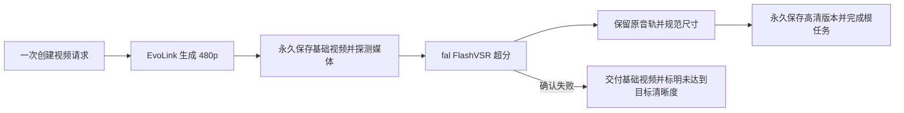

# Seedance 2.5 经济高清与通用视频超分方案

日期：2026-10-04。状态：方案，未实现产品编排、未部署。关联独立分支：`codex/seedance25-480p-upscale`。

## 决策

推荐先接 **EvoLink Seedance 2.5 480p → fal.ai FlashVSR → 720p / 1080p**，对用户表现为一次视频任务。内部将超分做成独立媒体处理能力，后续可复用于其他模型和已有视频。

第一版沿用已跑通的 FlashVSR 参数；先提供明确的“经济高清”选项，不改变现有请求中原生 720p 的含义。ByteDance Upscaler 在真实产物、排队和账单验证通过后，再评估是否成为更便宜的默认超分供应商。

## 与现有 Wan 3 的关系

当前代码中，Wan Standard / Prime 走 MuleRouter 的 CarrotHub 路由。480p / 720p / 1080p 使用普通生成接口，只有 2K / 4K 切换到包含超分的 Pro / Prime Pro 接口。Makaron 收到、轮询和结算的是一个供应商任务。

代码入口：`src/lib/video-model-capabilities.ts`、`src/lib/mulerouter-video.ts`、`src/lib/skills/create-video.ts`。旧实验文档中的默认模型和价格不能替代当前代码。

可以复用 Wan 的分辨率选择、异步任务、时间线和交付体验，但 Seedance 的生成与超分属于两个供应商，需要 Makaron 保存两个子任务并推进流程。当前代码没有经过验证的 MuleRouter / CarrotHub 独立视频超分接口；不能将 Seedance 产物作为 Wan Pro 的参考视频来替代纯超分，那会触发另一次视频生成。

FlashVSR 原项目为 [OpenImagingLab/FlashVSR](https://github.com/OpenImagingLab/FlashVSR)，本次实测 API 提供商为 [fal.ai](https://fal.ai/models/fal-ai/flashvsr/upscale/video)。不同第三方服务的模型版本和处理流程可能不同，不假设 Wan 内置版本与 fal 版本效果、参数和价格一致。

## 产品合同

保留 `model=seedance-2.5`，增加可选 `quality_mode=economy|native`。`video_resolution` 表示用户要求的最终交付分辨率。旧请求未带 `quality_mode` 时沿用现有原生路由；经济高清由明确选项或明确意图触发。

| 用户选择 | 生成阶段 | 后处理阶段 |
|---|---|---|
| 480p | 原生 480p | 无 |
| 经济高清 720p | 原生 480p | FlashVSR 后交付 720p |
| 经济高清 1080p | 原生 480p | FlashVSR 后交付 1080p |
| 原生 720p | 原生 720p | 无 |

原生 1080p 等单独验证和开放，第一版不扩展该能力。模型能力表区分原生生成分辨率与经济高清交付分辨率，不能直接把 1080p 填入现有原生支持列表。

App、Agent、CLI、MCP 使用同一个 delivery plan。用户明确要求“原生”时不切经济模式；经济模式显示“480p 生成后超分”，提供总报价，不把产物标为原生高清。中文、繁中、日文和英文同步补齐文案。

只创建一张任务卡和一个时间线占位：生成中 → 已生成，正在提升清晰度 → 高清视频完成。基础视频保存后可以预览，但根任务仍在处理中；最终文件替换占位，保留基础版本供下载或重新增强。

## 任务与存储

新增持久化根任务和子阶段记录，根任务 ID 不直接等于 EvoLink 或 fal 的供应商任务 ID。保存：所有者、关联 snapshot / billing request、目标与实际分辨率、delivery plan、阶段、供应商回执、基础与高清存储地址、媒体参数、报价明细、退款状态和阶段时间。

顶层状态沿用 `pending / processing / completed / failed`，另加 `stage` 和增强结果状态。基础预览地址与最终交付地址分开；超分失败后有可用基础视频的终态为 `completed`，同时必须返回增强失败及实际 480p，调用方不能误认为目标 1080p 已达成。

统一 `advanceVideoPipeline`：App 状态查询、Agent / MCP 状态查询和 Cron 都调用同一推进逻辑。供应商提交采用阶段唯一约束、数据库租约和保存回执的机制，避免浏览器轮询与 Cron 同时提交、重复付费。供应商缺失回执时进入不确定状态，不盲目重新提交；数据库锁本身不能消除供应商提交与保存回执之间的故障窗口。

不在一次 HTTP 请求或一次 LLM 工具调用内等待两个阶段完成。长耗时下载、音轨合并、编码与探测交给可续跑的媒体处理执行环境；Cron 和状态查询仅负责触发、查询、恢复。

现有 `get-video-status.ts`、视频 snapshot 状态接口和 `cron/video-poll` 有多处供应商分流，需要同时接入根任务解析。尤其不能在基础视频完成时就把 snapshot 的 `status` 设为完成，否则现有永久 URL 短路会跳过超分。超时按阶段和实际供应商状态判断，不机械沿用从根任务创建起算的单阶段超时。

基础与最终视频使用不同存储键。超分输入使用已永久保存的基础视频及有效访问地址，避免临时供应商 URL 过期。最终持久化完成后才标记交付完成；下载或保存失败只重试该步骤，不再次提交付费推理。

## 超分适配器与媒体合同

新增通用 `video-upscale` 适配器，接口覆盖 submit、status、cancel 和 quote，第一家为 `fal-ai/flashvsr/upscale/video`。复用现有 fal 认证和队列处理模式，保持 H3 专用适配器职责不变。供应商错误须脱敏，避免回显访问 URL 或密钥。

第一版默认 regular、color fix、quality 80、preserve audio，480p → 1080p 使用本次实测的 2.25 倍路径；720p 先从同一高清产物降采样。倍率依实际输入短边计算，不假设所有 480p 都是横屏 854×480。

交付检查：保留源帧率、时长、原始音轨和画幅；不默认插帧到 30fps。处理编码需要的偶数尺寸和供应商尺寸舍入，轻微裁边而不拉伸主体。音轨以基础视频为准，供应商音频不可靠时复制源音轨。验收须覆盖竖屏、方形和无声视频，不能仅凭横屏样片泛化。

后续单独验证直接 1.5 倍到 720p，可降低像素计费；现阶段不把该路径的成本和效果当成已验证。原项目推荐 4 倍超分，应加入 2.25 倍与 4 倍后降采样的效果、耗时和实际扣费对比，再决定默认参数。

## 计费、失败与取消

用户看到一份总报价，内部保存生成与超分两项独立费用。生成报价继续走现有价格表；超分按供应商输出宽 × 高 × 帧数计费，保存报价版本和计费尺寸，不按固定视频每秒价格写死。现有 markup 按统一定价合同计算，不能叠加两遍。

提交前预留总额度。自动时长或编辑模式先按已支持的时长上限预留，基础视频完成后用真实帧数和尺寸复核超分预算，金额不足时保留基础产物并要求明确追加额度，不默默扩大收费范围。最终多退少补遵循既有积分合同和用户授权上限。

| 情况 | 交付与结算 |
|---|---|
| 生成阶段确认失败 | 根任务失败，释放 / 退回对应额度 |
| 生成成功、超分确认失败 | 保留 480p，生成费用保留，仅结算 / 退回超分部分 |
| 状态查询网络失败 | 标记查询不确定，继续恢复，不作为供应商终态失败退款 |
| 超分完成、下载或存储失败 | 重试交付步骤，不重复付费超分 |
| 用户取消 | 停止后续阶段；确认供应商是否取消、是否已计费后结算，基础产物保留 |
| 用户重试增强 | 复用基础视频，仅创建新的增强尝试并单独报价 |

目前 MCP 失败结算是整个视频任务级别，需要扩展分阶段结算，避免基础生成已成功却整单退款。App 与 MCP 必须共用结果，不能各自实现不同规则。供应商服务繁忙时不自动切换到更贵的付费备用路由；切换条件和预算应在计划中明确。

## 成本与供应商选择

统一比较 10 秒、16:9、24fps、无视频参考，金额是供应商美元成本，不是 Makaron 用户积分：

| 路径 | 生成 + 超分估算 | 建议 |
|---|---:|---|
| 原生 720p | $2.960 | 保留原生选项 |
| 原生 1080p | $7.390 | 仅作报价对照，尚未开放 |
| 480p + FlashVSR 1080p | 约 $1.629 | 第一版默认超分路径；已有成功样片 |
| 480p + ByteDance Standard 1080p | 约 $1.452 | 待真实可用性和账单验收 |
| 480p + Topaz 4 倍后降采样 | 约 $2.260 | 本次服务繁忙失败，暂不优先 |

FlashVSR 公开价为 $0.0005 / 视频百万像素，1080p / 24fps 约 $0.0249/s；其成本会随真实输出尺寸和帧数变化。相比原生 720p 和 1080p，上述 FlashVSR 路径估算分别节省约 45% 和 78%。第一版 720p 也经过 1080p 中间产物，超分成本不会因最终降采样自动降低。

来源：[EvoLink Seedance 2.5](https://evolink.ai/seedance-2-5)、[fal FlashVSR](https://fal.ai/models/fal-ai/flashvsr/upscale/video)、[fal ByteDance Upscaler](https://fal.ai/models/fal-ai/bytedance-upscaler/upscale/video)、[EvoLink Topaz](https://evolink.ai/topaz-video-upscale)。视频参考输入另按 Seedance 的输入及输出时长计费，不适用本表。

本次 FlashVSR 4 秒样片约 44 秒完成，原音轨及帧数保留、浏览器播放通过；背景出现额外光斑，不能声称等价原生高清。ByteDance 修正参数后仍排队，已取消，没有成功产物。超分成本尚无 fal 实账，以上总价是公开价估算。

## 落地顺序与验收

1. 独立超分适配器：已有视频作为输入，真实验证提交、恢复、终态、音轨、尺寸和永久交付。先覆盖横屏 / 竖屏与无声 / 有声。
2. 两阶段根任务和分阶段结算：验证并发轮询不重复提交、回执缺失、超分失败保留基础视频、下载失败只重试交付、取消与仅增强重试。
3. App / Agent / CLI / MCP 接入同一个 delivery plan，四语言文案与报价一致；时间线只有一份成品，项目重新打开仍可播放并保留基础版本。
4. 小范围开放经济高清，用人脸、文字、快速运动、虚化背景、布料和重复纹理样本做连续播放对比，取得真实供应商扣费及排队数据后再决定默认与 ByteDance 路由。

本方案完成不代表产品链路已实现或上线。此前实验与样片证据见 [Seedance 480p 实验报告](../experiments/seedance25-480p-upscale-2026-10-04.md)。
