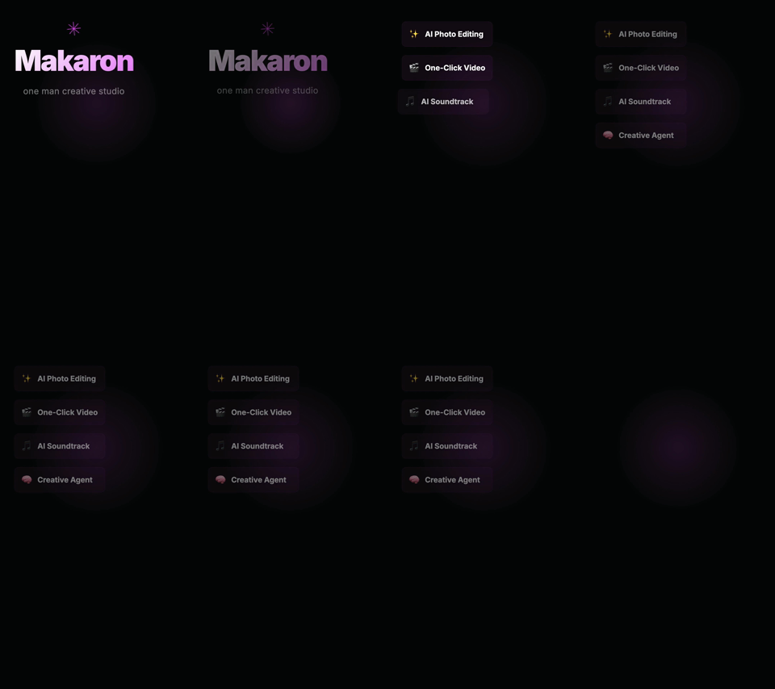
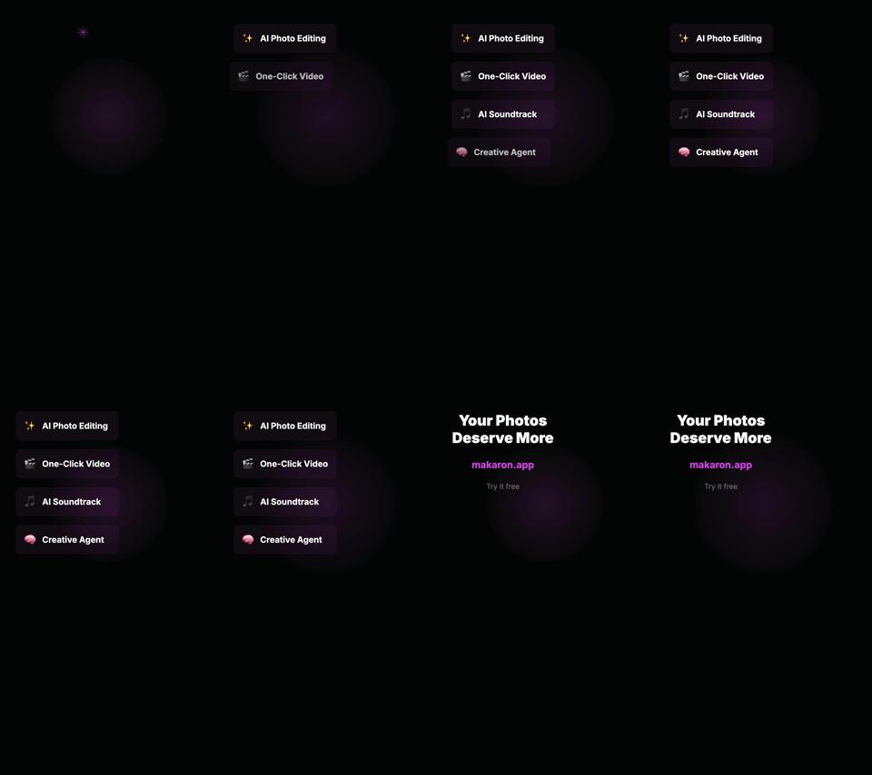
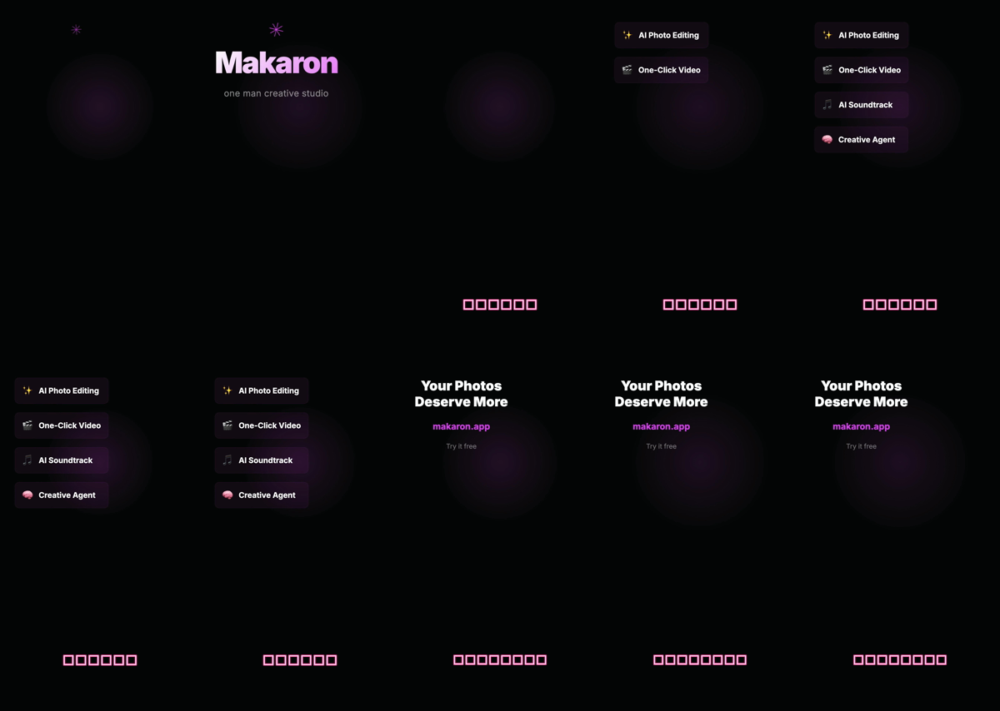
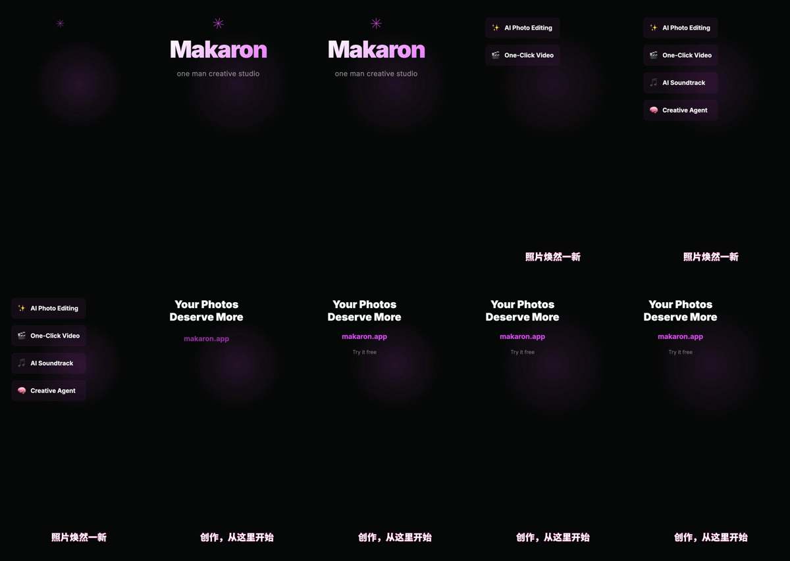
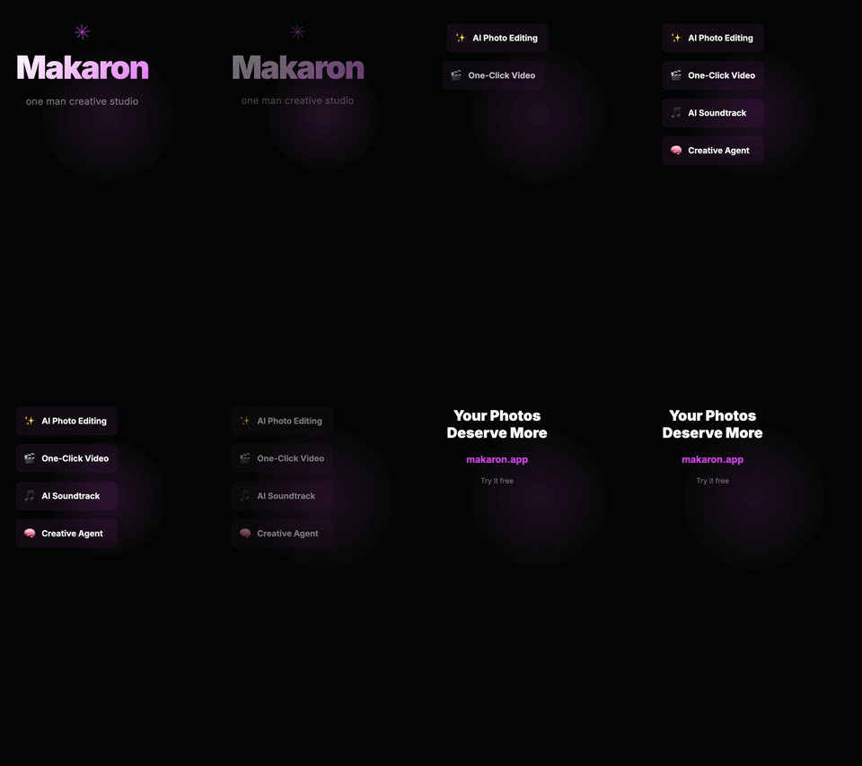
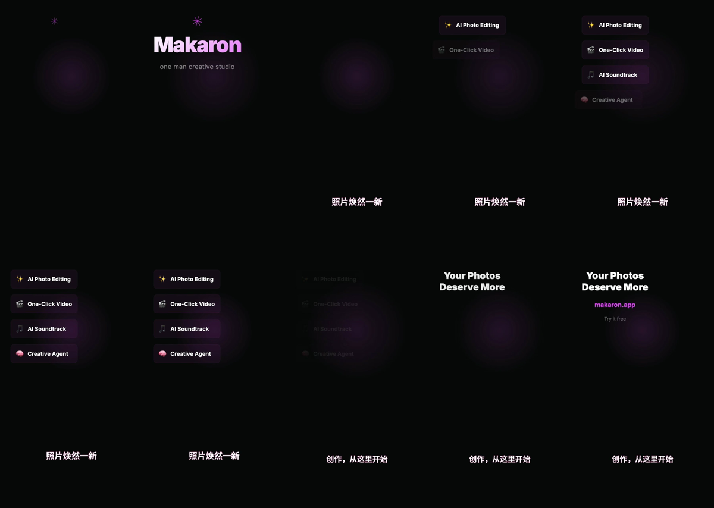

# GPT-6 Luna / GPT-5.6 Terra 视频剪辑对比（2026-09-23）

## 方法

- 素材：仓库自有 `makaron-intro/renders/makaron-intro_2026-05-07_02-05-55.mp4`，15 秒、1080×1920、30 fps、无音轨。
- 每题使用相同源文件、相同中文指令、新建独立项目；通过 `makaron chat --agent-model ...` 调用同一份本地工作树代码，媒体和计费走共享后端。两模型顺序交错，未并发跑同一题。
- “制作时长”从 Agent run 的 `created_at` 到 MP4 完成；不计新建项目和素材上传。第三题 Terra 的 Agent 先结束，Remotion MP4 稍后完成，因此采用 `remotion_export_jobs.completed_at`。
- 比较首次提交的成片。Luna 第三题后续修正另记，不改变首轮评分。所有成片均以 CDN URL 做 `ffprobe` 和 FFmpeg 全帧解码；关键画面另抽帧检查。
- 两条 Luna 修正版还在真实浏览器中打开 CDN MP4 并调用播放，视频元素均进入可播放状态、播放进度推进且无媒体错误。

| 任务 | Luna 首轮 | Terra 首轮 | 成片检查 |
|---|---:|---:|---|
| 1. 精确硬切：0–2、6–8、12–14 秒，6 秒预告片 | [MP4](https://cdn.makaron.app/storage/v1/object/public/images/5955d413-cad2-4814-b094-7fdf62d20400/workspace/2d188a85-faab-4ba8-95b2-3f05775ce7bf/media/1790127221166-makaron-teaser-6s.mp4) · 34.6 秒 · 2 Credits | [MP4](https://cdn.makaron.app/storage/v1/object/public/images/5955d413-cad2-4814-b094-7fdf62d20400/workspace/bf3273cd-8dfe-4167-b9ef-fb1698fef62f/media/makaron-6s-vertical-trailer.mp4) · 46.7 秒 · 31 Credits | 两成片均为 5.967 秒、1080×1920，SHA-256 完全相同：`f0204fd29e6017b96605115b2742602ad13bcaa8d2694dc1d5ceb6fbbd4c34c5`。两者通过。 |
| 2. 自选节奏：约 8 秒，Logo → 四项功能 → 网址 CTA | [MP4](https://cdn.makaron.app/storage/v1/object/public/images/5955d413-cad2-4814-b094-7fdf62d20400/workspace/c046fb91-5c25-4941-a2ce-edf60ec86676/media/1790127484680-makaron-social-ad-8s.mp4) · 42.8 秒 · 3 Credits | [MP4](https://cdn.makaron.app/storage/v1/object/public/images/5955d413-cad2-4814-b094-7fdf62d20400/workspace/9b81c320-4444-4046-a018-da43d706e12f/media/1790127412885-makaron-8s-vertical-social-ad.mp4) · 51.5 秒 · 34 Credits | 两者约 8 秒，四项功能可见。Luna 结尾 7.5 秒仍未清晰显示 `makaron.app`，未满足 CTA；Terra 结尾可见。Luna 还遇到无音轨映射错误后自行重试。 |
| 3. 中文社媒版：约 10 秒、两句字幕、网址结尾 | [MP4](https://cdn.makaron.app/storage/v1/object/public/images/5955d413-cad2-4814-b094-7fdf62d20400/workspace/173648f6-924d-4024-8b5c-f31244909094/media/1790127627192-makaron-zh-social.mp4) · 74.0 秒 · 4 Credits | [MP4](https://cdn.makaron.app/storage/v1/object/public/images/5955d413-cad2-4814-b094-7fdf62d20400/workspace/96bde14c-bca9-4800-bc9d-0e689752b9e0/media/remotion-makaron-cn-social-10s-31589526.mp4) · 107.4 秒 · 48 Credits | Luna 为 9.567 秒、1080×1920，但中文字幕显示方框，首轮不合格。Terra 为 9.984 秒、720×1280，中文清晰、CTA 可见，通过。Terra 的 Agent 阶段约 74.2 秒，后续 Remotion 导出约 37 秒。 |

三题首次 MP4 完成时长合计：Luna **151.4 秒**、Terra **205.6 秒**，Luna 快约 **26%**。含辅助视频分析的扣费合计：Luna **9 Credits**、Terra **113 Credits**。这是当前价格表与这三次运行的观察值，不是固定成本承诺。

## Luna 补救后的可用成片

| 任务 | 补救成片 | 补救新增 | 累计制作时长 / Credits |
|---|---|---:|---:|
| 2. 补足网址 CTA | [修正版 MP4](https://cdn.makaron.app/storage/v1/object/public/images/5955d413-cad2-4814-b094-7fdf62d20400/workspace/c046fb91-5c25-4941-a2ce-edf60ec86676/media/1790128205544-makaron-social-ad-8s-cta-fixed.mp4) · 7.925 秒、1080×1920；最后一秒实帧确认网址清晰 | 54.3 秒 · 4 Credits | 97.2 秒 · 7 Credits |
| 3. 修复中文字幕 | [修正版 MP4](https://cdn.makaron.app/storage/v1/object/public/images/5955d413-cad2-4814-b094-7fdf62d20400/workspace/173648f6-924d-4024-8b5c-f31244909094/media/remotion-makaron-zh-social-noto-1cc01277.mp4) · 9.877 秒、720×1280；中文、Logo、网址实帧可见 | 66.5 秒 · 3 Credits | 140.5 秒 · 7 Credits |

按“获得满足要求的成片”统计三题运行时长之和，Luna **272.3 秒 / 16 Credits**，Terra **205.6 秒 / 113 Credits**。Luna 仍省 Credits，但因两次补救，总制作时间比 Terra 多约 **32%**。此数字将同一任务的首次 run 与补救 run 时长相加，不含两次 run 之间的人工检查间隔。

## 抽帧证据

| 任务 | Luna | Terra |
|---|---|---|
| 2. 结尾 CTA |  |  |
| 3. 中文字幕 |  |  |

修正成片抽帧：

## 接入与限制

- Azure 正式环境变量对应的 Responses API 已对 `gpt-6-luna` 完成 HTTP 200 的真实函数调用，返回模型 ID 正确；本地配置的 `gpt-6-sol` 也在 Azure 模型列表中。无需转用 Codex subscription。当前个人套餐 relay 对 Terra 和 Luna 的探测均返回 400，本次 Auto 路由因而选择 Azure。
- GPT-6 Luna 对 96–224 像素纯色测试图的颜色判断不稳定；512 像素样本正确。这个小图视觉风险尚未通过真实产品样本消除。
- 这是本地代码 + 共享后端的实测。工作树改动的正式发布状态单独核验；项目网址和 CDN 成片存在，不代表新默认已上线。

## 官方模型与价格依据

- [OpenAI GPT-6 Luna 模型说明](https://developers.openai.com/api/docs/models/gpt-6-luna)
- [Azure GPT-6 模型与 Global Standard 价格](https://azure.microsoft.com/en-us/blog/gpt-6-astra-sol-and-luna-for-production-agents-in-microsoft-foundry/)
