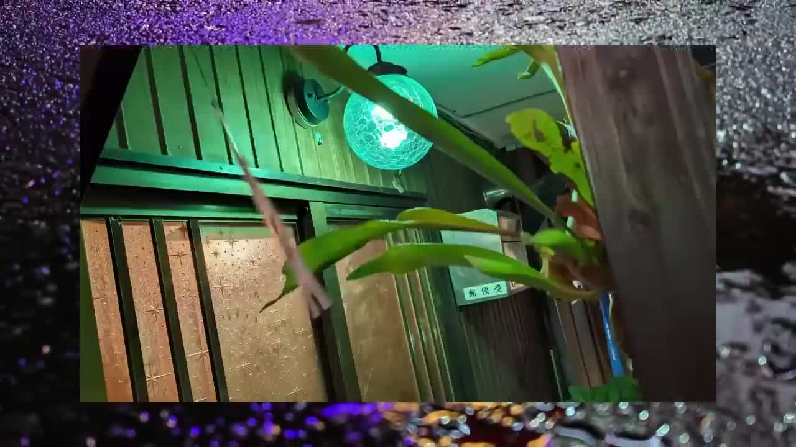

# Gemini 3.8 Flash 接入与真实线上对照

> 后续状态：用户已确认切换，2026-09-03 20:51 已在正式域名完成 3.8 切换。下面保留切换前的比较快照；当前状态见 [release.md](./release.md)。

核对日期：2026-09-03。分支 `codex/agentic-video-analysis`；worktree `/Users/tianyicai/ai-image-editor-agentic-video-analysis`。

## 当前状态

用户选择速度优先后，默认 Analyze Video 已在本分支改为 **Gemini 3.8 Flash + low thinking + static**。产品实现提交 `35a0ce16429a542bf1c61213760b2936f2b5cca8`；[独立 Preview](https://ai-image-editor-5pppj8hvh-vegekyd-sys-projects.vercel.app)。尚未合入 dev 或部署到生产。

Google 官方模型页及本次账号模型列表均确认 `gemini-3.8-flash`；列表没有 `gemini-3.9-flash`。3.8 支持 low / medium / high，最低是 low，不能沿用部分旧 Flash 的 minimal。[模型文档](https://ai.google.dev/gemini-api/docs/models/gemini-3.8-flash)

## 接入范围

- 统一视频描述 helper 覆盖 Agent `analyze_video` 的 describe、上传预分析、MCP 与 CLI `analyze`。已有 description 复用逻辑保留。
- 默认 static 走 GenerateContent；`VIDEO_ANALYSIS_PROCESSING=agentic` 使用 Interactions，要求真实 processing call/result 后才确认成功。`VIDEO_ANALYSIS_MODEL` 可显式覆盖模型。没有升级全仓 Google SDK。
- 视频普通 HTTP 地址直接下载一次：≤14 MB inline，14–38.5 MB 临时 Files 上传、等待 ACTIVE、推理后删除。超过 38.5 MB 明确报错。Google Files 和公开 YouTube URL 保留原生 URI 路径。大文件限制是当前适配器约束，不是 Gemini 能力上限。
- 120 秒主流程超时、下载限额、无文本/截断/模式未生效检查；provider 拒绝、限流、服务错误不会自动换模型或重复提交。
- 返回并记录模型、模式、thinking、transport、耗时及 input/output/cache/thought/tool usage；App 和 MCP 都接入实际 token 计费，MCP 不向 helper 重复传 userId。
- `locate_frame` 图+视频定位、真实抽帧后的图片复核，以及 Agent 主模型、Tips、生图、精确转录保持各自原有路径。这次不宣称截图定位能力已升级。

普通 URL 输入有真实兼容问题：相同 Google key，3.8 文本请求成功；视频 URL 请求 403，用相同视频 bytes 则成功。URL 失败请求花了 21.602 秒，inline 成功为 13.799 秒；修复后实际 adapter 为 15.384 秒。默认直接传短片内容避免这次失败往返，不是权限失败后静默换模型。[诊断结果](./transport-diagnostics.json)

初版 Preview 四次请求全部失败，完整保留在 [失败记录](./preview-cli-url-failure.json)，不计入性能数字。

## 对照方法

同一仓库 CLI、冻结问句、相同源视频，分别请求 `https://www.makaron.app` 和上面的 Preview；每个问题各一次。耗时含 CLI、网络、服务端处理和计费，本地素材还含上传；不是纯模型推理时间。线上模型按代码基线为 `gemini-3-flash-preview`，线上旧工具响应未回传模型 ID；候选响应显式标识 `gemini-3.8-flash / static / low`。

样本：Google 公开 Pixel 8 广告，57.208 秒、1280×720、有音轨、4,951,975 bytes；以及自己的 Makaron 产品介绍，15 秒、1080×1920、无音轨、约 1.4 MB。FFmpeg 抽查全片代表帧，另外密集检查 45.5–49.5 秒区域；本次不是盲评、长视频或亚秒定位 benchmark。

**速度提升明确，但本次质量不满足无损替换。** 四项真实调用均成功，合计 79.637 → 43.467 秒（耗时降低 45.4%）；每种任务只有一次，不能将此当成稳定平均延迟承诺。

| 问题 | 线上 | 3.8 low static | 耗时降低 | 质量抽查 |
| --- | ---: | ---: | ---: | --- |
| 57 秒广告全片概述 | 25.61 s | 16.04 s | 37.4% | 两者覆盖主要段落。新版时间范围没有旧版延伸到 1:00 的越界；不把全文视为逐句验证通过。 |
| 46–48 秒局部画面 | 19.30 s | 6.13 s | 68.2% | 新版只描述水面反射，漏掉 48.000 秒已出现的绿色球灯和前景叶片；旧版描述到了这个镜头。 |
| 人物介绍文字 | 15.70 s | 8.24 s | 47.6% | 两者读对姓名及 She/Her；新版另外读出 Photographer，旧版该题遗漏。 |
| 15 秒 Makaron 介绍片（含上传） | 19.02 s | 13.06 s | 31.3% | 两者读对主要文字。旧版正确识别无音轨；新版臆造“upbeat electronic track”。新版分段约 4/10 秒，也偏早。 |

[线上三项原文](./production-cli.json) · [线上 Makaron 介绍片](./production-intro-cli.json) · [候选四项原文](./preview-cli.json)

因此当前适合保留为可测的 3.8 候选。全量切换前要解决无音轨却推断配乐的问题，并用跨镜头短时段用例验证召回；不能只凭这组速度结果称“等效替换通过”。本次没有针对失败样片修改问句后重跑来掩盖差异。

48.000 秒的真实帧如下，足以证明新版局部回答漏掉了这一画面。旧版最后补充的“narrow alleyway”也没有被这张帧确认，不因此判旧版全句完全正确。



音轨证据：[FFprobe 与上传路径记录](./media-ground-truth.json)。Makaron 原文件只有 H.264 video stream，无 audio stream；CLI upload 直接 PUT 原始 bytes，不会添加配乐。

线上部署 ID 在测试前后均为 `dpl_E636sH1J2DatQH81K9YSdjR2z5g5`，对照期间生产目标未变化。


## 为什么默认没有开 agentic

在同模型、同视频 bytes、同问句、同 low thinking、同输出上限的本地 Interactions 对照中：static 21.788 秒，agentic 33.223 秒（慢 52.5%）。agentic 有两组 processing call/result，功能确实生效；更长的答复增加了整体延迟。[原始探针结果](./results-38-low.json)

该次 static 为 5,676 tokens，agentic 为 3,239 tokens；估算供应商成本分别 $0.005604 与 $0.005642。agentic 媒体输入少，但输出更长，所以没有成本优势。不能把更少输入 token 当成更快或更便宜。

Google 也把短于 5 分钟、重延迟的查询列为 static 的适用场景。agentic 仍可用于之后的长视频定向检索试验，本次没有做该类验收。[视频文档](https://ai.google.dev/gemini-api/docs/video-understanding)

## 计费核对

3.8 fallback 价格截至 2026-12-31 为 input $0.75/M、output（含 thinking）$3.75/M、cache read $0.075/M；2027-01-01 起恢复 $1.5 / $7.5 / $0.15。延续 2× markup 与 1 credit=$0.01，数据库显式配置优先。[官方价格](https://ai.google.dev/gemini-api/docs/pricing)

本次只读查询发现 DB 尚无 3.8 专属价格，也无 analyze_video 按次价格；旧 MCP 不返回 usage，因此本轮线上成功请求没有 analyze_video ledger。候选补齐 token usage 和 fallback rate，会实际扣费；不能把旧调用未扣费当成新模型成本上涨。

候选四个成功请求对应 **四条 ledger，均标记 gemini-3.8-flash**，分别扣 2 / 1 / 1 / 1 credits，共 5 credits；没有该 key 下同轮 analyze_video 的重复收费记录。失败 Preview 没有这类 ledger。[账单原始结果](./billing-audit.json)

| 问题 | 供应商估算成本 | 用户实际 credits |
| --- | ---: | ---: |
| 57 秒广告全片概述 | $0.006054 | 2 |
| 46–48 秒局部画面 | $0.004195 | 1 |
| 人物介绍文字 | $0.004031 | 1 |
| 15 秒 Makaron 介绍片（含上传） | $0.001487 | 1 |

供应商列按本次返回 usage 和公开价估算，尚未核对 Google 月度账单；用户 credits 列为真实 ledger。缓存与 thinking 的归一化有合同测试，本组 3.8 返回的 cache/thought 均为零。App helper 的扣费路径通过代码/测试核对，真实 ledger 验证范围是 CLI/MCP。


## 验证与限制

`35a0ce16` 已通过独立 runner 的 release:check、TypeScript、252 个测试文件 / 1,501 个单测、CLI smoke、本地 webpack build 与 Vercel cloud build。Preview health 13/13 healthy。既有 libheif 构建 warning 没有新增。

真实 Files 路径：把同一公开样片重编码为 22,390,555 bytes，实际上传、等待、3.8 分析和清理完成，57.415 秒，正确读出人物标签。[Files 验证](./files-transport-smoke.json)

小样本只能支持本轮接入验收，不能推出 P50/P95 或全场景质量排名；没有验证 10 分钟以上视频、复杂中文快剪、公开 YouTube、MOV/WebM 实际媒体或截图定位回归。没有生产切换，也没有修改共享 Preview/Production 环境变量或手工修改计费数据库。

## 复跑

```sh
node docs/research/agentic-video-2026-09-03/compare-cli.mjs \
  --url https://www.makaron.app \
  --out /tmp/production-video-comparison.json \
  --local-video /path/to/owned-video.mp4
```

CLI 使用当前用户身份，会按目标环境规则正常计费。用相同 source 和 question 更换 `--url` 进行对照。原始结果包含完整答案，不把健康检查或部署 Ready 当成真实效果验收。
